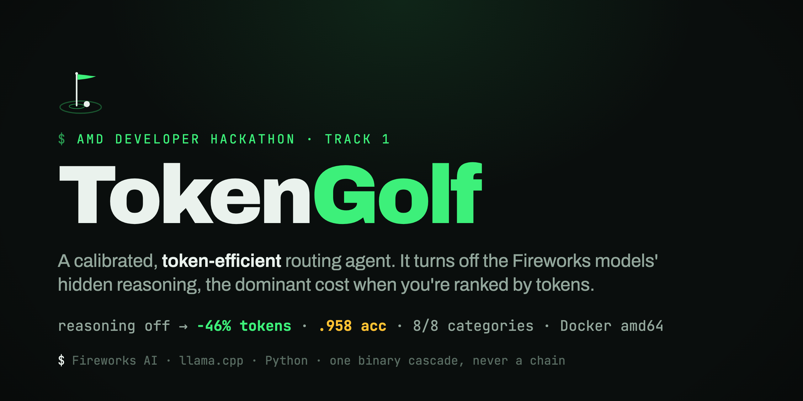

# TokenGolf: Token-Efficient Routing Agent (AMD ACT II, Track 1)

A Track-1 agent that answers tasks across 8 capability categories (factual, math, sentiment, summarisation, NER, code-debugging, logic, code-generation) using **as few Fireworks tokens as possible**. It reads `/input/tasks.json`, writes `/output/results.json`, and routes each task through a **calibrated local↔remote cascade**: a small local model (llama.cpp, CPU) answers the tasks it is confident on **for free** (local tokens score zero), and only the rest escalate to a single Fireworks model. Scored on an accuracy gate, then ranked by total tokens, so the design maximises free-local coverage while staying above the gate.

## How it works
- **Reasoning off is the token win.** Both allowed Fireworks models are reasoning models whose hidden reasoning dominates token cost. Setting `reasoning_effort="none"` cuts scored tokens ~46% with no measured accuracy loss (it was the dominant cost, not the answers).
- **Confidence-gated routing.** The local model is sampled with self-consistency; high agreement keeps the local answer (free), low agreement escalates to Fireworks. The keep/escalate threshold τ is **calibrated on held-out data** so kept-local answers stay accurate (no silent promotion).
- **Token-minimal by construction.** The leaderboard counts tokens, not dollars, so the cascade is binary (local, then one Fireworks call, never a chain of remote calls), the Fireworks prompt is terse and output-capped, and self-consistency runs only on the free local model.
- **Config, not code.** Models and thresholds are read from the environment at runtime.

## The harness contract
- Reads **`/input/tasks.json`**: `[{ "task_id", "prompt" }]`
- Writes **`/output/results.json`**: `[{ "task_id", "answer" }]`
- Environment (injected by the eval harness; do not hardcode): `FIREWORKS_API_KEY`, `FIREWORKS_BASE_URL` (all Fireworks calls route through it), `ALLOWED_MODELS` (comma-separated ids).

## Build & run
```bash
# Judging VM is linux/amd64. From the repo root:
docker buildx build --platform linux/amd64 -f docker/Dockerfile -t <registry>/router-agent:latest --push .

# Local smoke:
mkdir -p input output && echo '[{"task_id":"t1","prompt":"What is 2+2?"}]' > input/tasks.json
docker run --rm \
  -e FIREWORKS_API_KEY="$FIREWORKS_API_KEY" \
  -e FIREWORKS_BASE_URL="https://api.fireworks.ai/inference/v1" \
  -e ALLOWED_MODELS="accounts/fireworks/models/minimax-m3,..." \
  -v "$PWD/input:/input" -v "$PWD/output:/output" \
  <registry>/router-agent:latest
cat output/results.json
```

### Tuning knobs (env, no rebuild)
- `ROUTER_REASONING_EFFORT`: reasoning_effort for the Fireworks call (default `none`; set `""` to restore full reasoning). The headline token lever.
- `ROUTER_FW_MODEL`: which allowed model to call by name (e.g. `kimi`, `minimax-m3`).
- `ROUTER_SMARTLOCAL=1`: route sentiment/NER to the free local tier, everything else to Fireworks.
- `ROUTER_NO_LOCAL=1`: Fireworks-only baseline (skip the local tier).
- `ROUTER_CALIBRATOR`: path to a bundled calibrator JSON, enabling the local↔remote cascade with the calibrated τ.
- `ROUTER_SC_N`, `ROUTER_MAX_TOKENS`, `ROUTER_TAU`: self-consistency samples / output cap / escalation threshold.

## Layout
`src/router_agent/`: `cascade.py` (routing), `confidence.py` (self-consistency), `local_llm.py` (CPU GGUF free tier), `providers.py` (Fireworks seam), `threshold.py`/`calibration/` (τ + calibration), `tasks.py` (8-category dev sets + checkers), `run.py` (`submit` entrypoint). `experiments/`: eval + calibration harnesses. `docker/`: the amd64 image. `submission/deck/`: the pitch deck + brand assets.

## Development
```bash
uv run --extra dev pytest -q          # offline test suite
uv run --extra dev ruff check src/ tests/
```

## License
MIT (`LICENSE`). See `ATTRIBUTION.md` for acknowledgments: the established techniques this builds on and the open dataset used.
